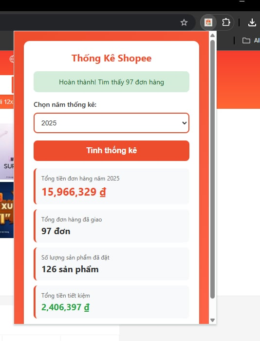

# 📊 Shopee Order Statistics

Tiện ích mở rộng Chrome giúp thống kê đơn hàng Shopee của bạn theo năm một cách nhanh chóng và trực quan.


## ✨ Tính năng

- 📈 **Thống kê chi tiết**: Xem tổng chi tiêu, số đơn hàng, số sản phẩm đã mua
- 💰 **Tính toán tiết kiệm**: Biết được bạn đã tiết kiệm được bao nhiêu từ các chương trình giảm giá
- 📅 **Chọn năm tùy ý**: Xem thống kê từ năm 2016 đến 2025
- 🚀 **Nhanh chóng**: Tự động fetch và tính toán từ API Shopee
- 🎨 **Giao diện đẹp mắt**: Thiết kế hiện đại với màu sắc Shopee chính thống
- 🔒 **An toàn**: Không lưu trữ bất kỳ dữ liệu cá nhân nào

## 📸 Screenshot




## 🚀 Cài đặt

### Từ Chrome Web Store
_(Sẽ cập nhật link khi được publish)_

### Cài đặt thủ công (Developer Mode)

1. Tải xuống hoặc clone repository này:
```bash
git clone https://github.com/hinh2003/shopee-order-statistics.git
```

2. Mở Chrome và truy cập `chrome://extensions/`

3. Bật **Developer mode** (góc trên bên phải)

4. Click **Load unpacked** và chọn thư mục chứa extension

5. Extension đã sẵn sàng sử dụng! 🎉

## 📖 Hướng dẫn sử dụng

1. **Đăng nhập Shopee**: Mở [shopee.vn](https://shopee.vn) và đăng nhập vào tài khoản của bạn

2. **Mở Extension**: Click vào icon Shopee Order Statistics trên thanh công cụ Chrome

3. **Chọn năm**: Chọn năm bạn muốn thống kê từ dropdown menu

4. **Tính toán**: Click nút "Tính thống kê" và đợi quá trình hoàn tất

5. **Xem kết quả**: 
   - Tổng tiền đơn hàng trong năm
   - Tổng số đơn hàng đã giao
   - Số lượng sản phẩm đã đặt
   - Tổng tiền tiết kiệm được

## 📋 Yêu cầu

- Google Chrome phiên bản 88 trở lên
- Tài khoản Shopee đã đăng nhập
- Kết nối internet ổn định

## 🔐 Quyền truy cập

Extension này yêu cầu các quyền sau:

- `cookies`: Để kiểm tra trạng thái đăng nhập Shopee
- `storage`: Lưu trữ cài đặt người dùng
- `scripting`: Inject script để lấy dữ liệu đơn hàng
- `activeTab`: Tương tác với tab Shopee đang mở
- `host_permissions`: Chỉ hoạt động trên domain shopee.vn

**Lưu ý**: Extension không lưu trữ hoặc gửi dữ liệu của bạn đến bất kỳ server nào. Mọi tính toán đều được thực hiện local trên trình duyệt của bạn.

## 🐛 Báo lỗi

Nếu bạn gặp bất kỳ vấn đề nào, vui lòng:

1. Kiểm tra bạn đã đăng nhập Shopee chưa
2. Đảm bảo bạn đang ở trang shopee.vn
3. Thử tải lại trang và extension
4. Nếu vẫn lỗi, hãy [tạo issue](https://github.com/yourusername/shopee-order-statistics/issues) với thông tin chi tiết

## 🤝 Đóng góp

Mọi đóng góp đều được chào đón! 

1. Fork repository
2. Tạo branch mới (`git checkout -b feature/AmazingFeature`)
3. Commit thay đổi (`git commit -m 'Add some AmazingFeature'`)
4. Push lên branch (`git push origin feature/AmazingFeature`)
5. Mở Pull Request

## 📝 Changelog

### Version 1.0.0 (2025)
- ✨ Phát hành phiên bản đầu tiên
- 📊 Thống kê đơn hàng theo năm
- 💰 Tính toán tiền tiết kiệm
- 🎨 Giao diện người dùng trực quan

## 📄 License

Dự án này được phát hành dưới giấy phép MIT - xem file [LICENSE](LICENSE) để biết thêm chi tiết.

## 👨‍💻 Tác giả

- GitHub: [@yourusername](https://github.com/yourusername)

## ⭐ Support

Nếu bạn thấy extension hữu ích, hãy cho một ⭐ trên GitHub!

## ☕ Donate

Nếu extension này giúp ích cho bạn, hãy mời tôi một ly cà phê! ❤️

### Momo


**Hoặc chuyển khoản trực tiếp:**
- 💳 Số tài khoản: `04242595201`
- 🏦 Ngân hàng: `TP Bank`
- 👤 Chủ tài khoản: `NGUYEN VAN TUAN HINH`


Cảm ơn bạn rất nhiều! 🙏

## 📞 Liên hệ

Có câu hỏi? Hãy tạo [issue](https://github.com/hinh2003/shopee-order-statistics/issues) hoặc liên hệ trực tiếp qua GitHub.

---

**Lưu ý**: Extension này không liên kết chính thức với Shopee. Đây là dự án độc lập được tạo ra để giúp người dùng thống kê đơn hàng của họ dễ dàng hơn.